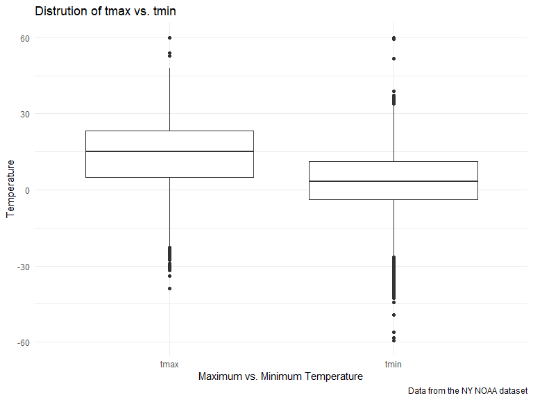

Homework 3
================
Tim Hauser

## Initial setup

``` r
library(tidyverse)
```

    ## ── Attaching packages ─────────────────────────────────────── tidyverse 1.3.2 ──
    ## ✔ ggplot2 3.3.6      ✔ purrr   0.3.4 
    ## ✔ tibble  3.1.8      ✔ dplyr   1.0.10
    ## ✔ tidyr   1.2.0      ✔ stringr 1.4.1 
    ## ✔ readr   2.1.2      ✔ forcats 0.5.2 
    ## ── Conflicts ────────────────────────────────────────── tidyverse_conflicts() ──
    ## ✖ dplyr::filter() masks stats::filter()
    ## ✖ dplyr::lag()    masks stats::lag()

``` r
library(ggridges)
library(patchwork)

library(p8105.datasets)

knitr::opts_chunk$set(
    echo = TRUE,
    warning = FALSE,
    fig.width = 8, 
  fig.height = 6,
  out.width = "90%"
)

theme_set(theme_minimal() + theme(legend.position = "bottom"))

options(
  ggplot2.continuous.colour = "viridis",
  ggplot2.continuous.fill = "viridis"
)

scale_colour_discrete = scale_colour_viridis_d
scale_fill_discrete = scale_fill_viridis_d
```

## Problem 1

Loading the instacart dataset:

``` r
data("instacart")

instacart = 
  instacart %>% 
  as_tibble(instacart)
```

In the following I will do an exploration of the dataset. First, to gain
an overview:

``` r
skimr::skim(instacart)
```

|                                                  |           |
|:-------------------------------------------------|:----------|
| Name                                             | instacart |
| Number of rows                                   | 1384617   |
| Number of columns                                | 15        |
| \_\_\_\_\_\_\_\_\_\_\_\_\_\_\_\_\_\_\_\_\_\_\_   |           |
| Column type frequency:                           |           |
| character                                        | 4         |
| numeric                                          | 11        |
| \_\_\_\_\_\_\_\_\_\_\_\_\_\_\_\_\_\_\_\_\_\_\_\_ |           |
| Group variables                                  | None      |

Data summary

**Variable type: character**

| skim_variable | n_missing | complete_rate | min | max | empty | n_unique | whitespace |
|:--------------|----------:|--------------:|----:|----:|------:|---------:|-----------:|
| eval_set      |         0 |             1 |   5 |   5 |     0 |        1 |          0 |
| product_name  |         0 |             1 |   3 | 159 |     0 |    39123 |          0 |
| aisle         |         0 |             1 |   3 |  29 |     0 |      134 |          0 |
| department    |         0 |             1 |   4 |  15 |     0 |       21 |          0 |

**Variable type: numeric**

| skim_variable          | n_missing | complete_rate |       mean |        sd |  p0 |    p25 |     p50 |     p75 |    p100 | hist  |
|:-----------------------|----------:|--------------:|-----------:|----------:|----:|-------:|--------:|--------:|--------:|:------|
| order_id               |         0 |             1 | 1706297.62 | 989732.65 |   1 | 843370 | 1701880 | 2568023 | 3421070 | ▇▇▇▇▇ |
| product_id             |         0 |             1 |   25556.24 |  14121.27 |   1 |  13380 |   25298 |   37940 |   49688 | ▆▆▇▆▇ |
| add_to_cart_order      |         0 |             1 |       8.76 |      7.42 |   1 |      3 |       7 |      12 |      80 | ▇▁▁▁▁ |
| reordered              |         0 |             1 |       0.60 |      0.49 |   0 |      0 |       1 |       1 |       1 | ▆▁▁▁▇ |
| user_id                |         0 |             1 |  103112.78 |  59487.15 |   1 |  51732 |  102933 |  154959 |  206209 | ▇▇▇▇▇ |
| order_number           |         0 |             1 |      17.09 |     16.61 |   4 |      6 |      11 |      21 |     100 | ▇▂▁▁▁ |
| order_dow              |         0 |             1 |       2.70 |      2.17 |   0 |      1 |       3 |       5 |       6 | ▇▂▂▂▆ |
| order_hour_of_day      |         0 |             1 |      13.58 |      4.24 |   0 |     10 |      14 |      17 |      23 | ▁▃▇▇▃ |
| days_since_prior_order |         0 |             1 |      17.07 |     10.43 |   0 |      7 |      15 |      30 |      30 | ▅▅▃▂▇ |
| aisle_id               |         0 |             1 |      71.30 |     38.10 |   1 |     31 |      83 |     107 |     134 | ▆▃▃▇▆ |
| department_id          |         0 |             1 |       9.84 |      6.29 |   1 |      4 |       8 |      16 |      21 | ▇▂▂▅▂ |

The Instacart Online Grocery Shopping Dataset is an anonymized dataset
with over 3 million online grocery orders from more than 200,000
Instacart users from 2017. It consists of 1384617 observations of
products orders, and 15 different variables: order_id, product_id,
add_to_cart_order, reordered, user_id, eval_set, order_number,
order_dow, order_hour_of_day, days_since_prior_order, product_name,
aisle_id, department_id, aisle, department. In total, there are 39123
products found in 131209 orders from 131209 distinct users.

Most important variables are:

-   order_id: order identifier
-   product_id: product identifier
-   user_id: customer identifier
-   order_number: order sequence number for this user (1=first, n=nth),
    rages from 4, 100
-   order_dow: day of the week on which the order was placed
-   days_since_prior_order: stands for days since the last order, capped
    at 30, NA if order_number = 1, ranges from 0, 30
    \*days_since_prior_order: aisle identifier, tells us the location of
    the item in the warehouse

The following table counts the number of times each aisle is used in the
list of orders and orders them by most frequent to least frequent:

``` r
instacart %>% 
  count(aisle) %>% 
  arrange(desc(n))
```

    ## # A tibble: 134 × 2
    ##    aisle                              n
    ##    <chr>                          <int>
    ##  1 fresh vegetables              150609
    ##  2 fresh fruits                  150473
    ##  3 packaged vegetables fruits     78493
    ##  4 yogurt                         55240
    ##  5 packaged cheese                41699
    ##  6 water seltzer sparkling water  36617
    ##  7 milk                           32644
    ##  8 chips pretzels                 31269
    ##  9 soy lactosefree                26240
    ## 10 bread                          23635
    ## # … with 124 more rows

In total, there are 134 aisles and the most frequently used are fresh
vegetables and fresh fruits.

The following is a plot showing the number of items ordered in each
aisle, limited to aisles with more than 10000 items ordered and ordered
in ascending order:

``` r
instacart %>% 
  count(aisle) %>% 
  filter(n > 10000) %>% 
  mutate(aisle = fct_reorder(aisle, n)) %>% 
  ggplot(aes(x = aisle, y = n)) + 
  geom_point() + 
  labs(title = "Number of items ordered in each aisle") +
  theme(axis.text.x = element_text(angle = 60, hjust = 1))
```


The next table shows the three most popular items in each of the aisles
“baking ingredients”, “dog food care”, and “packaged vegetables fruits”
and includes number of times each item is ordered in your table:

``` r
instacart %>% 
  filter(aisle %in% c("baking ingredients", "dog food care", "packaged vegetables fruits")) %>%
  group_by(aisle) %>% 
  count(product_name) %>% 
  mutate(rank = min_rank(desc(n))) %>% 
  filter(rank < 4) %>% 
  arrange(desc(n)) %>%
  knitr::kable()
```

| aisle                      | product_name                                  |    n | rank |
|:---------------------------|:----------------------------------------------|-----:|-----:|
| packaged vegetables fruits | Organic Baby Spinach                          | 9784 |    1 |
| packaged vegetables fruits | Organic Raspberries                           | 5546 |    2 |
| packaged vegetables fruits | Organic Blueberries                           | 4966 |    3 |
| baking ingredients         | Light Brown Sugar                             |  499 |    1 |
| baking ingredients         | Pure Baking Soda                              |  387 |    2 |
| baking ingredients         | Cane Sugar                                    |  336 |    3 |
| dog food care              | Snack Sticks Chicken & Rice Recipe Dog Treats |   30 |    1 |
| dog food care              | Organix Chicken & Brown Rice Recipe           |   28 |    2 |
| dog food care              | Small Dog Biscuits                            |   26 |    3 |

The next table displays the mean hour of the day at which “Pink Lady
Apples” and “Coffee Ice Cream” are ordered on each day of the week;
formatted in an agenda format (i.e., untidied):

``` r
instacart %>%
  filter(product_name %in% c("Pink Lady Apples", "Coffee Ice Cream")) %>%
  group_by(product_name, order_dow) %>%
  summarize(mean_hour = mean(order_hour_of_day)) %>%
  spread(key = order_dow, value = mean_hour) %>%
  knitr::kable(digits = 2)
```

    ## `summarise()` has grouped output by 'product_name'. You can override using the
    ## `.groups` argument.

| product_name     |     0 |     1 |     2 |     3 |     4 |     5 |     6 |
|:-----------------|------:|------:|------:|------:|------:|------:|------:|
| Coffee Ice Cream | 13.77 | 14.32 | 15.38 | 15.32 | 15.22 | 12.26 | 13.83 |
| Pink Lady Apples | 13.44 | 11.36 | 11.70 | 14.25 | 11.55 | 12.78 | 11.94 |

## Problem 2

Load and tidy the dataset (i.e., includes all originally observed
variables and values; has useful variable names; includes a weekday vs
weekend variable; encodes with reasonable variable classes, reordered
variables):

``` r
accel_df = read.csv("./data/accel_data.csv") %>% 
  janitor::clean_names() %>% 
  pivot_longer(
    activity_1:activity_1440,
    names_to = "minute",
    values_to = "activity_count",
    names_prefix = "activity_"
  ) %>% 
  rename(day_type_1 = day) %>% 
  mutate(
    day_type_2 = if_else((day_type_1 == "Saturday" | day_type_1 == "Sunday"),"Weekend","Weekday"),
    minute = as.numeric(minute),
    week = as.numeric(week),
    day_id = as.numeric(day_id),
    day_type_1 = factor(day_type_1, level = c("Monday","Tuesday","Wednesday","Thursday","Friday","Saturday","Sunday")),
    day_type_2 = factor(day_type_2, level = c("Weekday", "Weekend"))
  ) %>% 
  relocate(week, day_id, day_type_1, day_type_2, minute, activity_count)
```

The following helps to generate an overview of the tidied dataset:

``` r
skimr::skim(accel_df)
```

|                                                  |          |
|:-------------------------------------------------|:---------|
| Name                                             | accel_df |
| Number of rows                                   | 50400    |
| Number of columns                                | 6        |
| \_\_\_\_\_\_\_\_\_\_\_\_\_\_\_\_\_\_\_\_\_\_\_   |          |
| Column type frequency:                           |          |
| factor                                           | 2        |
| numeric                                          | 4        |
| \_\_\_\_\_\_\_\_\_\_\_\_\_\_\_\_\_\_\_\_\_\_\_\_ |          |
| Group variables                                  | None     |

Data summary

**Variable type: factor**

| skim_variable | n_missing | complete_rate | ordered | n_unique | top_counts                                 |
|:--------------|----------:|--------------:|:--------|---------:|:-------------------------------------------|
| day_type_1    |         0 |             1 | FALSE   |        7 | Mon: 7200, Tue: 7200, Wed: 7200, Thu: 7200 |
| day_type_2    |         0 |             1 | FALSE   |        2 | Wee: 36000, Wee: 14400                     |

**Variable type: numeric**

| skim_variable  | n_missing | complete_rate |   mean |     sd |  p0 |    p25 |   p50 |     p75 | p100 | hist  |
|:---------------|----------:|--------------:|-------:|-------:|----:|-------:|------:|--------:|-----:|:------|
| week           |         0 |             1 |   3.00 |   1.41 |   1 |   2.00 |   3.0 |    4.00 |    5 | ▇▇▇▇▇ |
| day_id         |         0 |             1 |  18.00 |  10.10 |   1 |   9.00 |  18.0 |   27.00 |   35 | ▇▇▇▇▇ |
| minute         |         0 |             1 | 720.50 | 415.70 |   1 | 360.75 | 720.5 | 1080.25 | 1440 | ▇▇▇▇▇ |
| activity_count |         0 |             1 | 267.04 | 443.16 |   1 |   1.00 |  74.0 |  364.00 | 8982 | ▇▁▁▁▁ |

The dataset contains five weeks of accelerometer data collected on a 63
year-old male with BMI 25, who was admitted to the Advanced Cardiac Care
Center of Columbia University Medical Center and diagnosed with
congestive heart failure (CHF). Concretely, it consitst of 50400
observations of activity counts (one for each minute of each day of a 5
week period), and 6 different variables: week, day_id, day_type_1,
day_type_2, minute, activity_count

-   week: week identifier, from 1, 5, numerical variable
-   day_id: day identifier, from 1, 35, numerical variable
-   day_type_1: day type 1 from Monday, Sunday, categorical variable
-   day_type_2: day type 2, Weekday vs. Weekend, categorical variable
-   minute: minute identifier, from 1, 1440, numerical variable
-   activity_count: activity count (for each minute)

Creating a table with total activity over each day (aggregated across
minute):

``` r
accel_df %>% 
  group_by(day_id) %>% 
  summarize(total_activity = sum(activity_count)) %>% 
  knitr::kable()
```

| day_id | total_activity |
|-------:|---------------:|
|      1 |      480542.62 |
|      2 |       78828.07 |
|      3 |      376254.00 |
|      4 |      631105.00 |
|      5 |      355923.64 |
|      6 |      307094.24 |
|      7 |      340115.01 |
|      8 |      568839.00 |
|      9 |      295431.00 |
|     10 |      607175.00 |
|     11 |      422018.00 |
|     12 |      474048.00 |
|     13 |      423245.00 |
|     14 |      440962.00 |
|     15 |      467420.00 |
|     16 |      685910.00 |
|     17 |      382928.00 |
|     18 |      467052.00 |
|     19 |      371230.00 |
|     20 |      381507.00 |
|     21 |      468869.00 |
|     22 |      154049.00 |
|     23 |      409450.00 |
|     24 |        1440.00 |
|     25 |      260617.00 |
|     26 |      340291.00 |
|     27 |      319568.00 |
|     28 |      434460.00 |
|     29 |      620860.00 |
|     30 |      389080.00 |
|     31 |        1440.00 |
|     32 |      138421.00 |
|     33 |      549658.00 |
|     34 |      367824.00 |
|     35 |      445366.00 |

Plotting above data for better visibility:

``` r
accel_df %>% 
  group_by(day_id) %>% 
  summarize(total_activity = sum(activity_count), day_type_2 = day_type_2) %>% 
  ggplot(aes(x = day_id, y = total_activity)) + 
  geom_point() + 
  geom_line() +
  geom_smooth(method = "lm", se = FALSE) +
  labs(
    title = "Total activity count per day",
    x = "Day ID",
    y = "Total Activity Counts",
    caption = "Data from the accel dataset"
    )
```

    ## `summarise()` has grouped output by 'day_id'. You can override using the
    ## `.groups` argument.
    ## `geom_smooth()` using formula 'y ~ x'


Looking at above graph it’s difficult to make out a trend, as total
activity counts vary greatly from day to day. The fitted line is
decreasing, indicating that total activity count seems to have been
going down over the course of the 5 weeks.

In the following I create a similar graph but separate weekdays from
weekends:

``` r
accel_df %>% 
  group_by(day_id) %>% 
  summarize(total_activity = sum(activity_count), day_type_2 = day_type_2) %>% 
  ggplot(aes(x = day_id, y = total_activity, color = day_type_2)) + 
  geom_point() + 
  geom_smooth(method = "lm", se = FALSE) +
  labs(
    title = "Total activity count per day, separated by weekday vs. weekend",
    x = "Day ID",
    y = "Total Activity Count",
    caption = "Data from the accel dataset"
    ) +
  theme(legend.title=element_blank()) +
  facet_grid(. ~ day_type_2)
```

    ## `summarise()` has grouped output by 'day_id'. You can override using the
    ## `.groups` argument.
    ## `geom_smooth()` using formula 'y ~ x'


The above graphs show that while total activity count for weekday
generally seemed to have increased over the course of the study, total
activity on weekends drastically declined over the same period.
Potentially, the test subject forgot to wear the accelerometer on the
weekends, since we get two days of complete inactivity.

The following graph is a single-panel plot that shows the 24-hour
activity time courses for each day and uses color to indicate day of the
week:

``` r
accel_df %>% 
  group_by(day_id) %>% 
  ggplot(aes(x = minute, y = activity_count, color = day_type_1)) + 
  geom_line(alpha = 0.5) +
  labs(
    title = "24-hour activity time courses for each day",
    x = "Hour of the day",
    y = "Activity Count",
    caption = "Data from the accel dataset"
    ) +
  scale_x_continuous(
    breaks = seq(0,1440,by = 60),
    label = seq(0,24,by = 1)) +
  theme(legend.title=element_blank())
```


First of all, the grah is quite cluttered, making it difficult to deduct
a lot from it. What can be said is that there is generally close to zero
activity during midnight-5am, very low activity between 5-6am &
10pm-midnight (we can assume this person usually goes to bed at 10pm and
wakes up at 6am), ‘normal’ activity from 6am-7.30pm and a period of high
activity between 7.30-10pm. It also becomes evident from the graph that
Sundays are quite slow days for this person, with generally low activity
throughout the day.

## Problem 3

Loading the dataset:

``` r
data(ny_noaa)
```

In the following I will do an exploration of the dataset. First, to gain
an overview:

``` r
skimr::skim(ny_noaa)
```

|                                                  |         |
|:-------------------------------------------------|:--------|
| Name                                             | ny_noaa |
| Number of rows                                   | 2595176 |
| Number of columns                                | 7       |
| \_\_\_\_\_\_\_\_\_\_\_\_\_\_\_\_\_\_\_\_\_\_\_   |         |
| Column type frequency:                           |         |
| character                                        | 3       |
| Date                                             | 1       |
| numeric                                          | 3       |
| \_\_\_\_\_\_\_\_\_\_\_\_\_\_\_\_\_\_\_\_\_\_\_\_ |         |
| Group variables                                  | None    |

Data summary

**Variable type: character**

| skim_variable | n_missing | complete_rate | min | max | empty | n_unique | whitespace |
|:--------------|----------:|--------------:|----:|----:|------:|---------:|-----------:|
| id            |         0 |          1.00 |  11 |  11 |     0 |      747 |          0 |
| tmax          |   1134358 |          0.56 |   1 |   4 |     0 |      532 |          0 |
| tmin          |   1134420 |          0.56 |   1 |   4 |     0 |      548 |          0 |

**Variable type: Date**

| skim_variable | n_missing | complete_rate | min        | max        | median     | n_unique |
|:--------------|----------:|--------------:|:-----------|:-----------|:-----------|---------:|
| date          |         0 |             1 | 1981-01-01 | 2010-12-31 | 1997-01-21 |    10957 |

**Variable type: numeric**

| skim_variable | n_missing | complete_rate |  mean |     sd |  p0 | p25 | p50 | p75 |  p100 | hist  |
|:--------------|----------:|--------------:|------:|-------:|----:|----:|----:|----:|------:|:------|
| prcp          |    145838 |          0.94 | 29.82 |  78.18 |   0 |   0 |   0 |  23 | 22860 | ▇▁▁▁▁ |
| snow          |    381221 |          0.85 |  4.99 |  27.22 | -13 |   0 |   0 |   0 | 10160 | ▇▁▁▁▁ |
| snwd          |    591786 |          0.77 | 37.31 | 113.54 |   0 |   0 |   0 |   0 |  9195 | ▇▁▁▁▁ |

The dataset contains variables for New York state weather stations from
January 1, 1981 through December 31, 2010.. Concretely, it consitst of
2595176 weather observations (one for day per weather station) and 7
different variables: id, date, prcp, snow, snwd, tmax, tmin

-   id: Weather station ID, character variable
-   date: Date of observation, ranging from 1981-01-01, 2010-12-31,
    numerical variable
-   prcp: Precipitation (tenths of mm), ranging from 0, 22860, numerical
    variable
-   snow: Snowfall (mm), ranging from -13, 10160, numerical variable
-   snwd: Snow depth (mm), ranging from 0, 9195, numerical variable
-   tmax: Maximum temperature (tenths of degrees C), character variable
-   tmin: Minimum temperature (tenths of degrees C), character variable

The dataset contains extensive missing data and completion rate are
problematic for all variables except id and date, . Most problematic are
tmax and tmin with a completion rate of only 56.3% an. Snow depth has a
completion rate of 77.2%, Snowfall one of 85.3% and precipitation one of
94.4%.

Cleaning the dataset:

``` r
ny_noaa = ny_noaa %>% 
  janitor::clean_names() %>%
  mutate(
    tmax = as.numeric(tmax),
    tmin = as.numeric(tmin),
    tmax = (tmax / 10),
    tmin = (tmin / 10),
    prcp = (prcp / 10),
    snow = (snow / 10),
    snwd = (snwd / 10)) %>% 
  mutate(
    date = lubridate::ymd(date)) %>%
  separate(date, into = c("year", "month","day")) %>% 
  mutate(
    year = as.integer(year),
    month = as.integer(month),
    day = as.integer(day))
```

The following table counts the number of times each snowfall value is
used in the list of weather observations and orders them by most
frequent to least frequent:

``` r
ny_noaa %>% 
  count(snow) %>% 
  arrange(desc(n))
```

    ## # A tibble: 282 × 2
    ##     snow       n
    ##    <dbl>   <int>
    ##  1   0   2008508
    ##  2  NA    381221
    ##  3   2.5   31022
    ##  4   1.3   23095
    ##  5   5.1   18274
    ##  6   7.6   10173
    ##  7   0.8    9962
    ##  8   0.5    9748
    ##  9   3.8    9197
    ## 10   0.3    8790
    ## # … with 272 more rows

The most frequent one is 0, as on most days of the year no snowfall is
observed in New York. The second most common one is NA, which could be
problematic as this means we have a lot of missing data. Next, the two
most frequent values for snowfall are 2.5 cm and 1.3 cm, meaning most
often when snowfall is recorded in New York it is only a very little
amount.

The following is a two-panel plot showing the average max temperature in
January and in July in each station across years:

``` r
ny_noaa %>% 
  filter(month %in% c(1, 7)) %>% 
  group_by(id, year, month) %>% 
  summarize(mean_tmax = mean(tmax)) %>% 
  ggplot(aes(x = year, y = mean_tmax, color = id)) + 
  geom_line() +
  labs(
    title = "Average max temperature across the years",
    x = "Year",
    y = "Average max temperature",
    caption = "Data from the NY NOAA dataset"
    ) +
  theme(legend.position = "none") +
  facet_grid(. ~ month)
```

    ## `summarise()` has grouped output by 'id', 'year'. You can override using the
    ## `.groups` argument.


Clearly, the average max temperature in January (around -10 to 8 deg
Celsius) is much lower than the corresponding variable in July (around
25 to 30 deg Celsius). There is a surprisingly large variation of
average max temperatures across the different measurement stations for
each year, for both January and July the temperature range between
stations for the same month and year is around 5 deg Celcius. Next,
there are quite a bit of fluctuations observed over the years of average
tmax temperature over the years for both January and July - it seems as
if warm Januarys were followed by warm Julys, and that particularly cold
years were 1994 & 2004 and particularly warm years 1990, 1998, 2002 &
2006.

The following is a plot showing tmax vs tmin for the full dataset:

``` r
ny_noaa %>% 
  select(tmax, tmin) %>% 
  drop_na() %>% 
  ggplot(aes(x = tmax, y = tmin)) + 
  geom_hex() +
  labs(
    title = "Tmax vs. Tmin",
    x = "Maximum Temperature",
    y = "Minimum Temperature",
    caption = "Data from the NY NOAA dataset"
    ) +
  theme(legend.text = element_text(angle = 60, hjust = 1))
```


There seems to be an (intuitive) trend that high maximum temperature is
also associated with a high minimum temperature. Most temperature pairs
are distributed on a relatively straight line between -10 / 5 deg
Celsius (minimum vs. maximum temperature) and 20 / 28 deg Celcius
(minimum vs. maximum temperature).

Next, I created a plot displaying the distribution of tmax and tmin
values:

``` r
ny_noaa %>% 
  pivot_longer(
    tmax:tmin,
    names_to = "temp_type",
    values_to = "temp") %>%
  ggplot(aes(x = temp_type, y = temp)) + 
  geom_boxplot() +
  labs(
    title = "Distrution of tmax vs. tmin",
    x = "Maximum vs. Minimum Temperature",
    y = "Temperature",
    caption = "Data from the NY NOAA dataset"
    )
```



Median maximum temperature is \~10 deg Celsius higher than mean minimum
temperature (15 vs. 5 deg Celsius). The values between first and third
quartile have a wider distribution in for maximum temperature as
compared to minimum temperature.

The following is a plot showing the distribution of snowfall values
greater than 0 and less than 10 cm separately by year:

``` r
ny_noaa %>% 
  filter(snow > 0 & snow < 10) %>% 
# because I changed the snowfall variable to cm, I adjusted the filter from 100 to 10
  select(year, snow) %>% 
  drop_na() %>% 
  group_by(year) %>% 
  summarise(n_obs = n()) %>% 
  ggplot(aes(x= year, y = n_obs)) + 
  geom_point() +
  geom_line() +
  labs(
    title = "Distrution of snowfall values between 0-10 cm across years",
    x = "Year",
    y = "Observation of snowfall between 0-10 cm",
    caption = "Data from the NY NOAA dataset"
    )
```


From the graphic we learn that the total number of observation of
snowfall values between 0-10cm pooled across all weather stations in NYC
were relatively stable between 1980 and 2006 with \~5’000-6’000
observations (only exception being 2003 with \~3’500 observations) but
that the number of observations of snowfall 0-10cm has subsequently
greatly increased since to over 12’500 observations in 2010. However,
this could be due to a chang e in the number of weather stations in New
York that collect weather information and is not necesarily a phenomenon
related to actual changes in climate.

To double check that hypothesis we look at the number of distinct
weather stations across the years:

``` r
ny_noaa %>% 
  filter(snow > 0 & snow < 10) %>% 
# because I changed the snowfall variable to cm, I adjusted the filter from 100 to 10
  select(year, id) %>% 
  group_by(year) %>% 
  summarise(n_stations = n_distinct(id)) %>% 
  ggplot(aes(x= year, y = n_stations)) + 
  geom_point() +
  geom_line() +
  labs(
    title = "Number of weather stations across years",
    x = "Year",
    y = "Number of distinct weather stations",
    caption = "Data from the NY NOAA dataset"
    )
```


In fact, the number of weather stations have greatly increased the years
2006-2010, which likely explains the increase in observations of
snowfall noted above.
